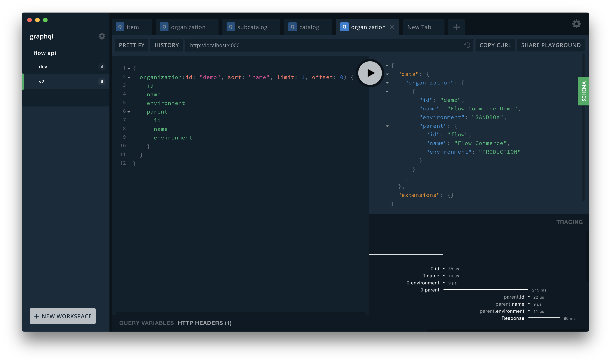
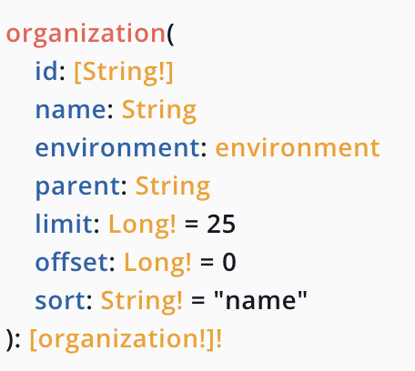
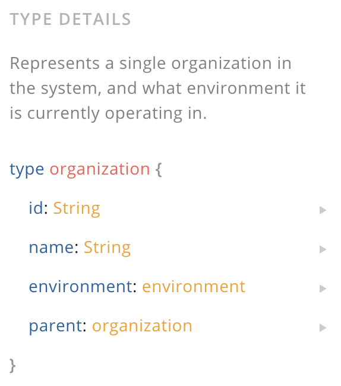

import { Split, FullScreenCode } from 'mdx-deck/layouts'
export { default as theme } from './theme'
import Box from 'superbox'

# GraphQL
#### Ben Iofel
#### flow.io

---

```notes
What is GraphQL?

query lang & implementation
language agnostic
ask for only what you need
cool dev tools
```

- A query language for your API
- Replaces REST

---

```js
fetch('https://swapi.co/api/films')
fetch('https://swapi.co/api/people/1')
fetch('https://swapi.co/api/people/3')
fetch('https://swapi.co/api/people/7')
fetch('https://swapi.co/api/people/8')
...
```

---

<Box fontSize={25}>

```graphql
{
  allFilms {
    films {
      title
      characterConnection {
        characters {
          name
        }
      }
    }
  }
}
```

</Box>

<a href="https://graphql.github.io/swapi-graphql/?query=%7B%0A%20%20allFilms%20%7B%0A%20%20%20%20films%20%7B%0A%20%20%20%20%20%20title%0A%20%20%20%20%20%20characterConnection%20%7B%0A%20%20%20%20%20%20%20%20characters%20%7B%0A%20%20%20%20%20%20%20%20%20%20name%0A%20%20%20%20%20%20%20%20%7D%0A%20%20%20%20%20%20%7D%0A%20%20%20%20%7D%0A%20%20%7D%0A%7D%0A" target="_blank">run</a>

---

# Type System

---

```notes
Everything has a type.
Everything is introspectable
```

```graphql
type Query {
  hero(episode: Episode): Character
  droid(id: ID!): Droid
}

type Starship {
  id: ID!
  name: String!
  length(unit: LengthUnit = METER): Float
}

...

union SearchResult = Human | Droid | Starship
```

---

```notes
hit ctrl+space
```

<a href="https://graphql.github.io/swapi-graphql/" target="_blank">dev tools</a>

---

```notes
some graphql servers report timing information
```



---

# Implementation

---

```js
const express = require('express');
const graphqlHTTP = require('express-graphql');
const { buildSchema } = require('graphql');

// Construct a schema, using GraphQL schema language
const schema = buildSchema(`
  type Query {
    rollDice(numDice: Int!, numSides: Int): [Int]
  }
`);
```

---

```js
// The root provides a resolver function for each API endpoint
const root = {
  rollDice: function ({numDice, numSides}) {
    const output = [];
    for (let i = 0; i < numDice; i++) {
      output.push(1 + Math.floor(Math.random() * (numSides || 6)));
    }
    return output;
  }
};
```

---

```js
const app = express();
app.use('/graphql', graphqlHTTP({
  schema: schema,
  rootValue: root,
  graphiql: true,
}));
app.listen(4000);
console.log('Running a GraphQL API server at localhost:4000/graphql');
```

---

```notes
- a graphql server that is backed by REST calls
1. Incrementally add your own implementation.
2. Make one request over internet and many requests in the same data center
```

<h1><a href="https://github.com/apicollective/graphql-rest-proxy" target="_blank">graphql-rest-proxy</a></h1>

Easily wrap your REST API in GraphQL

---

```notes
all you need is a json config
you define your models, enums, unions
```

```json
"models": {
  "organization": {
    "fields": [
      { "name": "id", "type": "string" },
      { "name": "name", "type": "string" },
      { "name": "environment", "type": "environment" }
    ]
  }
}
```

---

```notes
you define resources as shown
each resource becomes a top-level query
```

export default FullScreenCode

```json
"resources": {
  "organization": {
    "many": {
      "path": "/organizations",
      "params": {
        "id": { "type": "[string]", "required": false, "maximum": 100 },
        "name": { "type": "string", "required": false },
        "environment": { "type": "environment", "required": false },
        "limit": { "type": "long", "default": 25, "minimum": 1, "maximum": 100 },
        "offset": { "type": "long", "default": 0, "minimum": 0 },
        "sort": { "type": "string", "default": "name" }
      }
    }
  }
}
```

---



---

export default FullScreenCode

```notes
the value of graphql comes when you link objects together
```

```json
"models": {
  "organization": {
    "links": [
      {
        "name": "parent",
        "type": "organization",
        "params": [
          {
            "name": "id",
            "location": "instance",
            "expression": "$.parent.id"
          }
        ]
      }
    ]
  }
}
```

---

```notes
for each org we can find its parent

each time you want the parent, that's another HTTP request
```



---

```notes
one last plug
we use apibuilder at flow
allows you to model your api, like swagger
```

<h1><a href="https://apibuilder.io" target="_blank">APIBuilder</a></h1>

- generates servers, clients, mocks, prop-types
- Scala, JS, Ruby, Go, ...
- generate a config.json for graphql-rest-proxy 

---

# Any Questions?
# Thank you

---

# Resources

- Slides: [graphql-flow.now.sh](https://graphql-flow.now.sh)
- [GraphQL](https://graphql.org)
- [Apollo](https://apollographql.com)
- [graphql-rest-proxy](https://github.com/apicollective/graphql-rest-proxy)
- [apibuilder-js-generators](https://github.com/apicollective/apibuilder-js-generator/tree/master/src/generators/node_graphql)
- [APIBuilder](https://apibuilder.io)
